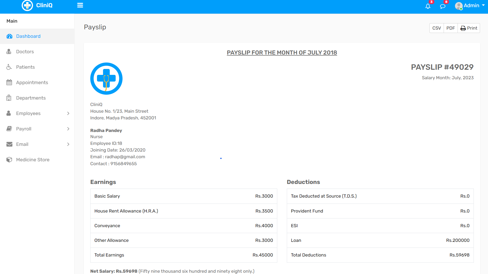

# Hospital Management System

Our Hospital Management System is a user-friendly web application created using Node.js, MySQL, Express, and EJS. It aims to streamline daily hospital tasks and improve overall efficiency in managing various operations.

## Features

- **Doctor List:** This feature enables easy management of hospital doctors. You can effortlessly add, remove, or update their details as needed.

- **Appointments:** Patients can conveniently schedule appointments with doctors online. Doctors, in turn, can efficiently view and manage their schedules through this system.

- **Employee Records:** Our project facilitates the organization of employee information and their respective payslips. This functionality simplifies staff management and payroll processes.

- **Medicine Store:** The system includes a dedicated section for hospital medicines. Administrators can effectively manage medicine inventory by adding new medicines and removing outdated ones.

## Getting Started

Follow these steps to get the Hospital Management System up and running:

1. **Clone or Download:** Begin by cloning this repository to your local machine or downloading the project's source code.

2. **Install Dependencies:** Open a command prompt within the project folder and run the command `npm install` to install the necessary dependencies. You can also use `npm update` if needed.

3. **Database Setup:** Import the provided database file into your MySQL server. This will establish the required database structure for the system.

4. **Run the Application:** In the command prompt, type `nodemon app` (or alternatively, use `node app`) to start the application.

5. **Access the System:** Open your web browser and navigate to the appropriate address where the system is hosted. You can typically access it by entering `http://localhost:3000` in the address bar.

## Screenshots

Here are some screenshots showcasing different sections of the Hospital Management System:

- **Home**
  

- **Sign Up**
  

- **Dashboard**
  

- **Medicine Store**
  

- **Pay Slip**
  

- **Add Employee Leave**
  

## Conclusion

Our Hospital Management System is designed to provide a seamless and efficient solution for various hospital operations. By leveraging modern web technologies, we aim to simplify tasks, enhance doctor-patient interactions, improve staff management, and ensure effective medicine inventory control.
